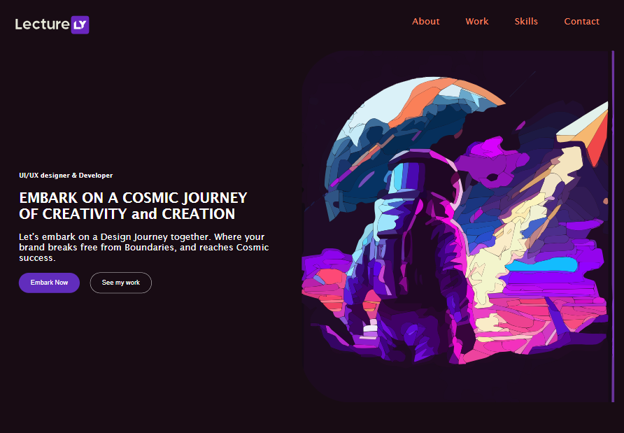

# Lecturely - Personal Portfolio Landing Page

## Introduction

Hello there! 👋

Thank you for taking part in this HTML+CSS Workshop by Lecturely. This project will help you learn HTML and CSS by building a hands-on project. It is going to be a personal portfolio landing page, from this workshop you'll walk away with a personal portfolio. You can keep updating this portfolio with your latest projects and development/designing skills.

**By the end of this workshop you should be equipped with HTML+CSS, to build something from scratch, on your own**

So I request you to think of this workshop as a coding challenge, you are provided all the starting material below. Although I'll guide you through this challenge, read the content below as if it is a challenge you must work out on your own!

## Plan for your next three days

#### Day-1 Introduction to Web Development and HTML Basics

- Workshop Introduction and Icebreaker
- Understanding the Web
- Setting Up the Development Environment
- Introduction to HTML and the basic structure of a web page
- Working with other HTML elements
- Creating the Basic Structure of our portfolio Web Page
- Exercise: Building the Structure of the portfolio site
- Quiz Session

---

#### Day-2 CSS Fundamentals and Styling

- Recap of Day-1 and quiz review
- Introduction to CSS and its Role in Web Developement
- CSS Selectors and Properties
- CSS Box Model: Understanding Element Dimensions
- Default styling and layout of HTML
- Key Features of the CSS
- CSS Flexbox
- Styling the Portfolio sections

### Day-3 Advance CSS and Responsive Design.

- CSS Animations and Transitions
- Media Queries
- Viewport Meta Tag
- Adding responsiveness to portfolio sections

## The Challenge

Your task is to build a personal portfolio landing page that closely matches the design that was provided. This Portfolio website is divided into five sections. You are also provided with the wireframes for each section to understand the structure of the HTML Document, so look at the wireframes before starting out with a section.

**Your users should be able to:**

- View the landing page with an hero image, in an optimal layout based on their device's screen size, such as desktop, Tablet, mobile
- Observe hover states for interactive elements which are
  - the Contact Me button which leads the user to the contact form,
  - Explore Now Button which leads the user to your work section
- The skills elements in the skills section are not interactive, but they'll glow on hover (you know just for fun!)

If you need any support or have questions during the challenge, feel free to ask me for assistance, or discuss it with your peers, after all, it has to be interactive, else it is yet another online course, which you're tired of repeating 10 secs back ;).

## Resources

- [Create your Github Account](https://github.com/)
- [Download VScode](https://code.visualstudio.com/download)
- 

## Project Assets

- In the `/design` folder, you will find the final designs files for both mobile and desktop versions of the landing page.Please take a moment to review these thoroughly before diving into the workshop.

- In the `/Wireframes` folder, you will find the design/sketches each section os the portfolio website. Please refer to these as you work though this project.

- The designs are in static JPG format, so you'll need to use your judgment for styles like `font-size`, `padding`, and `margin`.

- The `/assets` folder contains all the necessary assets, which are already optimized for use in the project, they are going to be in SVG format because vector-based images scale way better than pixel-based images.

**Note** : We will refer to the `style-guide.md` file for essential information, such as the color palette and fonts to be used.

## Building Your Project

Here's a suggested process, but you're not obligated to follow it:

1. Initialize your project as a public repository on [GitHub](https://github.com/). Having a repository will make it easier to share your code with others if you need assistance. If you're not familiar with creating a repository, you can refer to the [Try Git resource](https://try.github.io/).
2. Carefully examine the designs to plan how you'll approach the project. This step is crucial for thinking ahead and creating reusable CSS classes.
3. Start by structuring your content using HTML. Writing your HTML first will help ensure your content is well-organized.
4. Develop the base styles for your project, including general content styles such as `font family` and `font-size`.
5. Begin styling from the top sections of the page and work your way down. Make sure to complete each section before moving on to the next.
6. Once you're done with your website on localhost, host it on GitHub pages. Configure your repository to publish your code to a web address. This will enable you to share the URL of your portfolio website to showcase it anywhere. There are various ways to achieve this, and we will go through the options below.

## Deploying Your Project

As mentioned earlier, there are several free options available for hosting your project. Here are our recommended hosts:

- [GitHub Pages](https://pages.github.com/)
- [Vercel](https://vercel.com/)
- [Netlify](https://www.netlify.com/)

However we are going to deploy on github pages.

# Note for author

- keep skill section for students to implement
